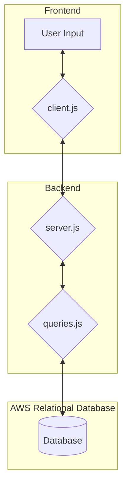

# Team Please Compile WEC 2024 Documentation - cogIN

## 1. Pre-requisites, Motive, and Description

### 1.1 Languages
HTML, CSS, Javascript, PostgreSQL, and a AWS RDB was used to create this project. All frameworks are included as,

- Bootstrap (5.3.2)
- Node.js (21.6.2)
- Express.js (4.18.2)
- Postgres Client (8.11.3)
- DotEnv (16.4.1)

### 1.2 Motive
cogIN is a small startup founded in Winnipeg, Manitoba Canada that focuses on supporting our clients with cognitive disabilities in preserving their independance.

### 1.3 Description
cogINs' app is to focus on maintaining our users independance by providing a scheduling system, journal entry, and notification system by setting their entries as public or private with respect to the vision of the caretaker/nurse account.

## 2. Stack & Installation

### 2.1 Frontend

mermaid TBD

### 2.2 Backend 

mermaid TBD

### 2.3 Database

mermaid TBD

### 2.4 Installation

ssh TBD

## 3. References

[1] [Bootstrap (5.3.2)](https://getbootstrap.com/docs/5.3/getting-started/introduction/)
[2] [Node.js (21.6.2)](https://nodejs.org/docs/latest/api/)
[3] [Express.js (4.18.2)](https://expressjs.com/en/4x/api.html)
[4] [Postgres Client (8.11.3)](https://node-postgres.com/)
[5] [DotEnv (16.4.1)](https://www.dotenv.org/docs/)
[6] [Amazon Relational Database](https://docs.aws.amazon.com/rds/)

Developed by:
 [Syed Abraham Ahmed](https://www.linkedin.com/in/syed-abraham-ahmed/) 
 [Daigh Burgess](https://www.linkedin.com/in/daigh-burgess/)
 [Garizaldy Gerra](https://www.linkedin.com/in/garizaldygerra/)
 [Connor Pagtakhan](https://www.linkedin.com/in/connor-pagtakhan-5a617b206/)